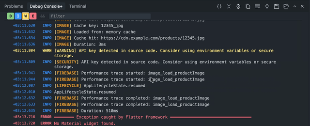

# Debug Console+

[](https://marketplace.visualstudio.com/items?itemName=Pomisoft.debug-console-plus)

A better debug console for VS Code / Cursor. Filter, search, and let AI query your logs.

**Latest release:** 0.0.7 — see [CHANGELOG.md](CHANGELOG.md) for notes.



## Features

- **Level filtering** — toggle debug / info / warn / error with one click
- **Smart parsing** — detects `[debug]`, `[error]`, etc. tags in log messages automatically
- **Search** — filter logs by text or regex, combine with AND/OR logic; with Debug Console+ focused, **Cmd+F** / **Ctrl+F** focuses the filter field
- **Save / load logs** — export or restore sessions from the **…** (more) menu in the view title bar
- **Timestamps** — show/hide, auto-hides on narrow panels
- **Compact** — strip timestamps, Android logcat tags, and box-drawing for clean output
- **Copy all** — copies filtered logs to clipboard
- **Auto-scroll** — follows new logs, pauses when you scroll up
- **MCP server** — exposes a `query_debug_logs` tool so AI agents in Cursor can search and filter your logs

## MCP Integration

AI agents can query your debug logs using the built-in MCP server.

**Setup:** open the **…** (more) menu in the Debug Console+ title bar, then choose **Set Up MCP Server** (plug icon).

Example queries an agent can answer:
- "Show me only errors"
- "Find logs containing 'users' that are errors"
- "Show recent warnings"

## Install

```bash
npm install
npm run compile
```

## Build

```bash
npx --yes @vscode/vsce package
```

## License

MIT
